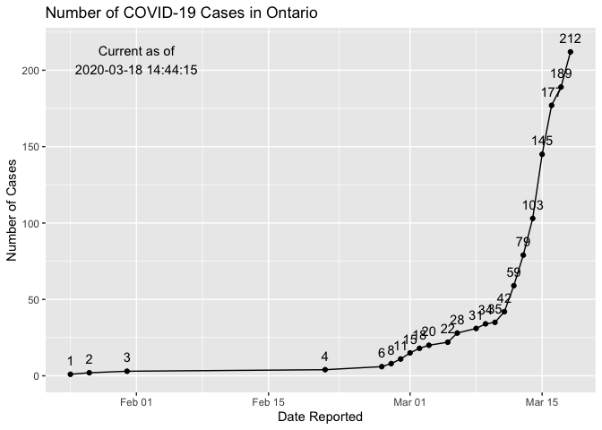
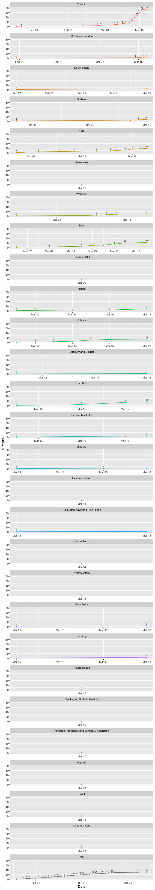

Ontario COVID-19 Dataset
================

## Load in the data

## Load Data

``` r
df <- read_csv("Data/ontario_corona_cases.csv")
```

    ## Parsed with column specification:
    ## cols(
    ##   Case_number = col_double(),
    ##   age_gender = col_character(),
    ##   Public_Health_Unit = col_character(),
    ##   Hospital = col_character(),
    ##   Transmission = col_character(),
    ##   Status = col_character(),
    ##   Date = col_date(format = "")
    ## )

## Total Cases in Ontario

This chart shows the exponential growth in COVID-19 cases in Ontario as
of 2020-03-17 15:00:34. To date there are 185 cases of COVID-19 as
reported by the Ontario government.

``` r
current_time <- Sys.time()

df %>% 
  group_by (Date) %>% 
  count () %>% 
  ungroup() %>% 
  mutate (cumsum = cumsum(n)) %>% 
  # print (n = Inf)
  ggplot (aes (x = Date, y = cumsum)) +
  geom_line() +
  geom_point() +
  scale_y_continuous(limits = c(0, length (df$Case_number) + 5)) +
  labs (title = "Number of COVID-19 Cases in Ontario",
        x = "Date Reported",
        y = "Number of Cases") +
  geom_text (aes (label = cumsum), 
             vjust = -1) +
  annotate("text", x = as.Date("2020-02-01"), y = length(df$Case_number) - 5, 
           label = paste0("Current as of\n", current_time )
           )
```

<!-- -->

## Cases Reported by Health Unit

Most of cases are reported in Toronto however the virus is spreading to
other regions.

``` r
df %>% 
  group_by (Date, Public_Health_Unit) %>% 
  count () %>% 
  group_by (Public_Health_Unit) %>% 
  mutate (cumsum = cumsum (n)) %>% 
  arrange (Public_Health_Unit) %>% 
  ggplot (aes (x = Date, y = cumsum, colour = Public_Health_Unit)) +
  geom_line (aes (group = 1)) +
  geom_point(size = 1) +
  geom_text(aes (label = cumsum), 
            vjust = -1, 
            size = 3, 
            colour = "black") +
  facet_wrap(~ Public_Health_Unit) +
  theme (legend.position = "none")
```

    ## geom_path: Each group consists of only one observation. Do you need to adjust
    ## the group aesthetic?
    ## geom_path: Each group consists of only one observation. Do you need to adjust
    ## the group aesthetic?
    ## geom_path: Each group consists of only one observation. Do you need to adjust
    ## the group aesthetic?
    ## geom_path: Each group consists of only one observation. Do you need to adjust
    ## the group aesthetic?
    ## geom_path: Each group consists of only one observation. Do you need to adjust
    ## the group aesthetic?
    ## geom_path: Each group consists of only one observation. Do you need to adjust
    ## the group aesthetic?
    ## geom_path: Each group consists of only one observation. Do you need to adjust
    ## the group aesthetic?
    ## geom_path: Each group consists of only one observation. Do you need to adjust
    ## the group aesthetic?
    ## geom_path: Each group consists of only one observation. Do you need to adjust
    ## the group aesthetic?

<!-- -->
